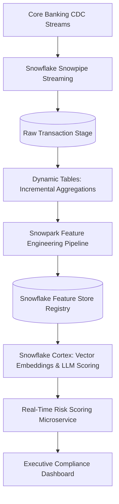

# Snowflake Enterprise Feature Store & GenAI Pipeline

A production-grade Feature Store and embedding feature registry engineered entirely inside Snowflake using Snowpark Python, Dynamic Tables, Snowflake Cortex AI, and Streamlit.

---

## 🏛️ Architecture & Data Flow

---

## 🚀 Core Capabilities
- **Zero-Copy Feature Serving:** Low-latency online feature lookups coupled with offline point-in-time time-travel features for model training.
- **Native Cortex AI Embeddings:** Generating 1024-dimensional semantic embeddings directly in SQL via `SNOWFLAKE.CORTEX.EMBED_TEXT_768`.
- **Dynamic Table Orchestration:** Lag-driven materialization avoiding continuous compute expenditure while ensuring 1-minute freshness.
- **Data Governance & Masking:** Snowflake Tagging and Dynamic Data Masking ensuring PII/PCI-DSS compliance.

---

## 🛠️ Tech Stack
- **Data Warehouse:** Snowflake (Virtual Warehouses, Snowpark, Dynamic Tables)
- **AI / LLM:** Snowflake Cortex AI, Snowpark ML
- **Language & Runtime:** Python 3.10+, SQL, PySpark / Snowpark DataFrames
